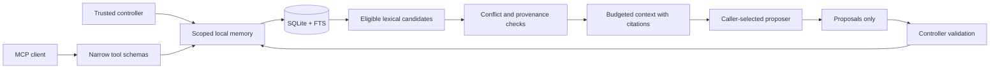

# Mnemosyne 2 architecture

Two explicit engines share a package: a portable local kernel and a compatibility Qdrant integration. The release does not run a distributed memory mesh automatically.

## Local data flow

An instance fixes workspace and agent selectors. SQL scope predicates apply to reads; ownership constrains writes. Workspace sharing is explicit and dependencies cannot disclose private evidence. These are application invariants inside trusted controller code, not authentication against someone with filesystem access.

Records, typed checkpoints with optional source/procedure dependencies, outcomes, idempotency entries, versions, and audit data persist in SQLite. Mutations use transactions. Corrections supersede sources and invalidate descendants; forgetting removes content and its dependent closure. Snapshot import validates scope and graph consistency before committing.

Lexical search quotes Unicode terms and uses SQLite FTS to enumerate scoped active matches. Per-record scoring avoids unrelated corpus statistics influencing another scope. Ranking retains bounded top-k results while scanning matching candidates; broad queries still scale with the number of matches. Context eligibility is checked before truncating candidates, so failed sources cannot starve valid later results.

Compilation treats an explicit keyed conflict as an atomic group. A recommendation with unresolved conflicts in its provenance is withheld. Conflicting task checkpoints cause abstention. The renderer includes citations and an evidence-only instruction envelope. The budget covers rendered text, not the structured inspector response. A caller-supplied tokenizer gives model-specific accounting; the default uses UTF-8 bytes.

## Reflection boundary

Reflection is one optional proposer call, with input/output/time/proposal budgets and cancellation signaling. It writes nothing. Source revisions include transitive provenance and scoped outcome state. Commitment checks that state again and requires a trusted controller's validation. It stores observed experience with validation metadata and retry identity. This is external memory synthesis, not weight updates or autonomous self-certification.

## Qdrant compatibility

The factory validates configuration and embeddings, checks collection dimensions, and awaits scoped keyword-index bootstrap. Hybrid ranking preserves similarity scores; keyword-only matches hydrate their full records. Graph enrichment also hydrates through scoped live reads. Cached results are revalidated. Collection configuration and cache namespaces are instance-specific.

Safe maintenance uses a scoped database handle. Destructive historical URL-only helpers fail closed. Optional graph and broadcast services remain separate dependencies. Local lifecycle semantics are not silently retrofitted onto every historical backend helper.

## Operational limits

SQLite operations are synchronous; large scans can block their process. The package does not supply authentication, encrypted storage, distributed consensus, background synchronization, or an HTTP service. Run a separate process per trust boundary and keep database/snapshot permissions under operator control. Test the actual model, client, workload, and storage environment before making reliability claims.
