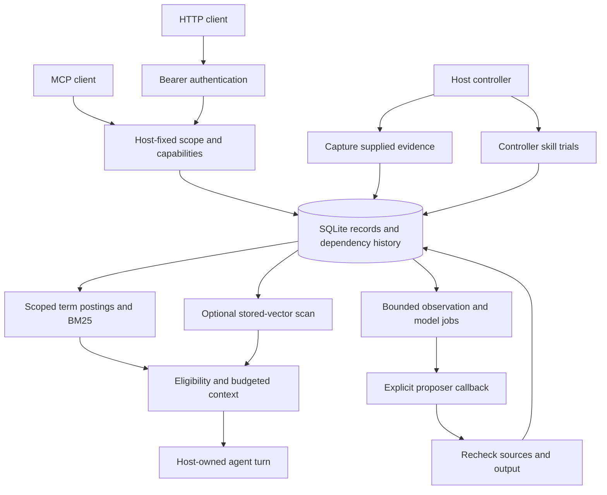

# Mnemosyne architecture

Mnemosyne connects an agent's evidence, reusable procedures and current context through an inspectable local lifecycle. Its portable engine uses SQLite; the separate `createMnemosyne` compatibility API supports existing service-backed installations. Starting the local engine does not connect those services or create a distributed memory mesh.

## Local data flow

The host selects the database, workspace and agent. Records default to private; workspace sharing is explicit. Scope predicates constrain API reads and ownership constrains writes, including dependencies that could otherwise reveal private evidence. A process with direct database access remains trusted. [HTTP authentication](docs/RUNTIME.md#http-inspector-and-python) adds a transport boundary; scope identifiers alone are not credentials.

## Storage and lifecycle

Canonical records, dependencies, versions, outcomes, checkpoints, retry identities and audit state persist in SQLite. Runtime sources, jobs, topic models and skills use protected control records. Mutations use transactions and the database uses WAL. Search postings and vectors are derived state tied to their source records; additive index upgrades preserve the existing record and snapshot format.

An explicit correction supersedes the old fact and invalidates declared descendants. Conflicting active texts with the same explicit fact key remain a conflict. The engine does not infer every natural-language contradiction or every possible dependency. Forgetting removes covered live content and derived state. Runtime source tombstones block replay of a known forgotten capture identity after reopening; they cannot remove copies already exported or sent elsewhere.

A checkpoint can preserve a task's goal, decisions, completed work, artifacts and next action. Declared source dependencies allow a correction to retire obsolete handoffs. Conflicting shared checkpoint state makes resume fail explicitly rather than silently selecting one account of the task.

## Ranking and temporal context

Local lexical retrieval defaults to **BM25** with outcome adjustments. The implementation stores normalized term frequencies in `local_terms` and document lengths in `local_search`; it does not use SQLite FTS. Document statistics are scoped by authorized owner/workspace visibility, trust, kind and temporal availability. Compilation additionally applies evidence eligibility before retaining candidates. The explicit `lexicalScoring: 'overlap'` option preserves the earlier scorer for comparisons. BM25 statistics scan the scoped document set; a retained-candidate limit is not a constant-time bound on database work.

Optional hybrid recall generates lexical and dense candidates independently, then combines ranks before optional reranking. Dense retrieval scans the scoped stored-vector history with bounded result retention and a deadline; it is exact scanning, not an approximate-nearest-neighbor service. Index identity includes the provider/model revision and dimensions, and source hashes prevent stale vectors from restoring corrected advice. The host explicitly chooses a remote endpoint or [local CPU providers](docs/LOCAL-MODELS.md), provisions models and invokes indexing.

`recall`, `compile`, `recallHybrid` and `compileHybrid` accept `asOf` and `knownAt`: when the fact applied and what had been recorded by the knowledge cutoff. Validity starts inclusively and ends exclusively. Historical context includes the selected clocks and an explicit historical-evidence warning. Omitting both selects the current view. Outcome and dependency checks use the same knowledge cutoff. Erasure remains erasure; a historical query cannot recover forgotten content.

Compilation treats explicit conflicts as atomic groups and withholds recommendations with failed or conflicted provenance. `ContextPacket.text` contains the budgeted evidence envelope and citations; structured records and diagnostics are outside that text budget. The default counter uses UTF-8 bytes. Applications can supply a model-specific tokenizer. [Adaptive context](docs/CONTEXT.md) adds source-backed representations, exact source expansion and state-checked reuse; its semantic summaries still depend on the chosen proposer.

## Runtime and action boundaries

[MemoryRuntime](docs/RUNTIME.md) captures supplied visible messages, queues durable observation jobs and maintains source-backed models. Work occurs only when a host runs the bounded worker or starts its own agent loop. Claims are leased, callbacks have limits and source state is rechecked at dispatch and before commit. Schema and provenance validation cannot establish that generated prose is true.

New applications can select `RECOMMENDED_SKILL_PROMOTION_POLICY`: successful trials spanning at least two distinct task IDs and two verifier IDs. Requirements are stored with each candidate and survive reopening under a weaker host default. Compatibility construction retains one task/one verifier. Candidates remain non-advisory until their stored gate is satisfied; failed trials, prerequisites or evidence changes can retire them. The host must supply authentic results: distinct labels do not prove independent execution.

[MemoryAgent](docs/AGENT.md) joins before-turn context, after-turn capture and optional bounded processing. Action tickets bind an exact action and arguments to its declared dependency state and are revalidated before dispatch. They do not authorize the action, discover undeclared dependencies or lock an external system. [Maintenance](docs/MAINTENANCE.md) supports explicit freshness policies and last-confirmed source checks; ordinary retrieval does not automatically fetch a source or confirm its truth.

## Entry points and migration

| Entry point | Responsibility |
|---|---|
| `mnemosy-ai/local` | SQLite lifecycle, scope, lexical/hybrid retrieval and temporal compilation. |
| `mnemosy-ai/runtime`, `/agent`, `/context` | Capture, bounded processing, trials and context around host-owned agent work. |
| `mnemosy-ai/mcp`, `/http`, `/adapters` | Narrow protocol tools, authenticated HTTP and provider command envelopes. |
| `mnemosy-ai/maintenance`, `/profiles`, `/relations`, `/branches` | Freshness, typed fields, evidence-backed graph traversal and staged changes. |
| `mnemosy-ai/bridge`, `/migration` | Read-only legacy coexistence and reviewed full export imports. |
| `mnemosy-ai/operations`, `/evaluation` | Whole-database recovery and explicit measurement protocols. |

The [bridge](docs/BRIDGE.md) copies encountered legacy records while continuing to query the old system for reconciliation. Adoption credit concerns observed queries, not a complete account scan or answer correctness. [Full migration](docs/MIGRATION.md) previews explicit export profiles, validates scope and source bytes, then applies a reviewed plan atomically. Neither path converts unsupported foreign semantics or silently changes the old backend.

The compatibility vector API retains its actual Qdrant, graph and broadcast identifiers. It uses separate backend configuration and lifecycle behavior; the local runtime is not silently enabled by starting optional services. See [deployment](docs/deployment.md) and [migration from existing versions](docs/MIGRATION-v2.md).

## Operations and evidence

The authenticated HTTP service binds tokens to configured principals, checks capabilities and supports revocation. The CLI serves on loopback. Remote TLS, enterprise identity, quotas and a managed multi-tenant service remain application deployment responsibilities. Synchronous SQLite scans can block their process; measure your corpus and isolate workloads accordingly.

Database files and [backup bundles](docs/OPERATIONS.md) are plaintext. Whole-database recovery includes every owner and restores to a new path; portable scoped exports serve a different purpose. There is no automatic cloud synchronization, installed scheduler, model-weight training or universal framework hook.

The [public retrieval reports](docs/evaluation/BENCHMARKS.md) measure evidence coverage and packing. [Lifecycle diagnostics](docs/evaluation/EVIDENCE-PROTOCOL.md) measure defined synthetic cases, including remaining failures. Generated-answer quality and comparative agent success require separate matched experiments. No retrieval score establishes AGI or superiority to another memory system.
