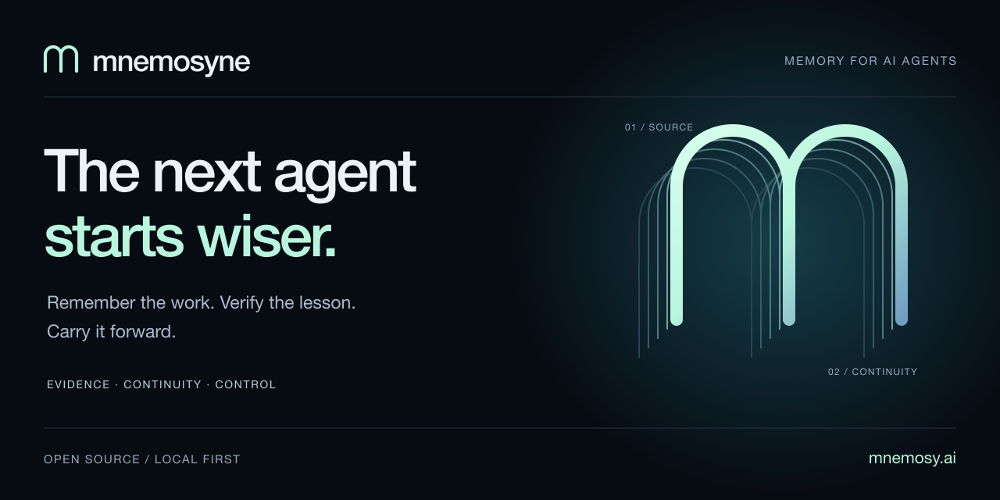
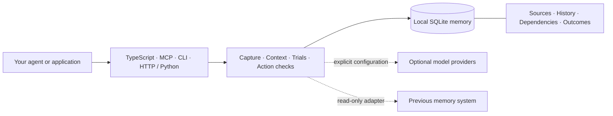

[](https://mnemosy.ai)

# Mnemosyne

[](https://github.com/28naem-del/mnemosyne/actions/workflows/ci.yml)
[](https://github.com/28naem-del/mnemosyne/releases/tag/v2.0.0-rc.8)
[](LICENSE)

**The next agent starts wiser.**

Persistent memory for AI agents that need to carry work forward, recover original evidence, and stop following a lesson when its source changes.

Mnemosyne connects memory to its consequences: a corrected requirement can retire a dependent procedure, a failed trial can withhold a skill, and a new agent can resume from an explicit handoff. Run the local engine in one SQLite file; connect your host through TypeScript, MCP, CLI, or authenticated HTTP with a Python client and live inspector.

**2.0.0-rc.8 · Source release candidate · MIT · Node.js ≥22.16**

[Website](https://mnemosy.ai) · [Quickstart](docs/quickstart.md) · [Documentation](docs/README.md) · [Examples](examples/README.md) · [Migration](docs/BRIDGE.md) · [Measured results](docs/evaluation/BENCHMARKS.md) · [Download](https://github.com/28naem-del/mnemosyne/releases/tag/v2.0.0-rc.8) · [Contributing](CONTRIBUTING.md)

## Start with a working demonstration

Build the source candidate. These commands do not depend on an rc.8 release being available from npm or PyPI. Node 24 is recommended; the local memory engine needs no model API key, database server, or Docker.

```sh
git clone --branch v2.0.0-rc.8 --depth 1 https://github.com/28naem-del/mnemosyne.git
cd mnemosyne
npm ci --ignore-scripts
npm run build
npm run demo
npm run demo:learning
```

The first demo uses a temporary database to show a handoff, correction, private scope and forgetting. The learning demo exercises capture, a scripted observation job, skill trials, explicit sharing and correction-driven retirement. Both run real local APIs with deterministic fixtures and no model calls. [Choose your next example](examples/README.md).

For full contributor validation, run `npm run check`. A current `main` development checkout also includes `npm run check:docs`, introduced after rc.8. The release includes prebuilt JavaScript and Python downloads with [SHA-256 checksums](https://github.com/28naem-del/mnemosyne/releases/tag/v2.0.0-rc.8).

To consume your built checkout from another project, run `npm install /absolute/path/to/mnemosyne` in that project. Keep the checkout and its `dist` directory available. Use the exact GitHub release tag when reproducing behavior; registry publication is a separate release step.

## A correction should change what the next agent does

```js
import { createLocalMemory } from 'mnemosy-ai/local';

const memory = createLocalMemory({
  path: './agent-memory.sqlite',
  workspaceId: 'catalogue',
  agentId: 'designer',
});

const brief = memory.store({
  text: 'Product images must be 1200 by 900 pixels.',
  kind: 'fact',
  key: 'catalogue.image-size',
  source: { uri: 'brief://catalogue/v1' },
  trust: 'observed',
  visibility: 'workspace',
});

const procedure = memory.store({
  text: 'Export catalogue product images at 1200 by 900 pixels.',
  kind: 'procedure',
  source: { uri: 'run://designer/export' },
  trust: 'observed',
  dependencies: [brief.id],
  visibility: 'workspace',
});

memory.correct(brief.id, {
  text: 'Product images must be 1600 by 1200 pixels.',
  source: { uri: 'brief://catalogue/v2' },
  reason: 'The delivery specification changed.',
});

console.log(memory.get(procedure.id)?.status); // invalidated
const context = memory.compile({
  query: 'catalogue product images',
  maxTokens: 2048,
});
console.log(context.text); // Send eligible context to your responder.
// Inspect context.citations and context.uncertainty alongside the text.
memory.close();
```

The old procedure remains inspectable but is no longer eligible as current guidance. Dependencies must be declared by the controller. `observed` means the host recorded the source; it does not certify its truth. The default context counter measures UTF-8 bytes conservatively, not a model's tokenizer. [Context contract](docs/CONTEXT.md).

## What you can build

| Capability | Behavior | Developer guide |
|---|---|---|
| **Memory with evidence** | Private-by-default records, explicit sharing, corrections, conflicts, source history and dependent retirement. | [Local API](docs/api.md) |
| **Continuity across agents** | Structured checkpoints preserve goals, decisions, artifacts and next actions; source changes can retire obsolete handoffs. | [Agent lifecycle](docs/AGENT.md) |
| **Adaptive context** | Budgeted observations, hierarchical summaries and expandable original source bytes, with evidence revalidation. | [Context](docs/CONTEXT.md) |
| **Recall across words and meaning** | Scoped BM25 by default; optional embeddings, hybrid fusion and reranking over authorized records. | [Local semantic retrieval](docs/LOCAL-MODELS.md) |
| **Memory across time** | Separate `asOf` and `knownAt` queries, scheduled corrections and causal invalidation history. | [Runtime](docs/RUNTIME.md) |
| **Evidence-gated skills** | Candidate procedures, explicit trial requirements and retirement after failed or changed evidence. | [Skills and trials](docs/RUNTIME.md#project-models-skill-trials-and-traces) |
| **Source-backed profiles** | Typed fields report supported values, unknowns or conflicts and revalidate their inputs. | [Profiles](docs/PROFILES.md) |
| **Silent-staleness checks** | Explicit source policies, last-confirmed evidence, bounded probes and action-bound dependency checks. | [Freshness](docs/MAINTENANCE.md) |
| **A controlled transition** | Read-only access to your previous store, gradual local preference, reconciliation and routing rollback. | [Gradual migration](docs/BRIDGE.md) |
| **Full import and recovery** | Eleven export profiles, preview, atomic application, replay protection, guarded undo and whole-database backups. | [Import](docs/MIGRATION.md) · [Recovery](docs/OPERATIONS.md) |
| **Host-controlled processing** | Durable bounded jobs, source-backed project models, outcome traces, entity relations and staged changes. | [Runtime](docs/RUNTIME.md) |

## One memory engine, several entry points



The host chooses identities, trust assertions, providers and execution budgets. Construction starts no worker or model download. `MemoryAgent` can prepare context before a turn and capture supplied visible input/output afterward; background work runs only when the host starts it. [Host loop](docs/AGENT.md).

The local database holds memories, vectors and runtime state. Optional local CPU providers run cached inference in separate processes after explicit provisioning. Their dependency requirements, model identities and licenses are documented in the [local model guide](docs/LOCAL-MODELS.md). The existing backend integration remains available through `createMnemosyne`; it does not automatically synchronize with the local engine. [Version 1 migration notes](docs/MIGRATION-v2.md).

### Connect through MCP

After building, add a server entry to your MCP client. Replace the example path and choose an existing parent directory for the database.

```json
{
  "command": "node",
  "args": [
    "/absolute/path/mnemosyne/dist/cli/index.js", "mcp",
    "--db", "/absolute/path/data/memory.sqlite",
    "--workspace", "my-project", "--agent", "assistant"
  ]
}
```

Use `--read-only` to omit mutation tools. Forgetting requires an explicit `--allow-destructive` launch. Models cannot choose another workspace, promote their own trust, or report successful trials through MCP. For an authenticated service, Python access and a live inspector, see [HTTP and Python](docs/RUNTIME.md#http-inspector-and-python). Native provider tool protocols are documented in the [adapter guide](docs/PROVIDER-TOOLS.md).

### Require stronger skill evidence

```js
import { createLocalMemory } from 'mnemosy-ai/local';
import {
  MemoryRuntime,
  RECOMMENDED_SKILL_PROMOTION_POLICY,
} from 'mnemosy-ai/runtime';

const memory = createLocalMemory({
  path: './skills-memory.sqlite', workspaceId: 'my-project', agentId: 'assistant',
});
const runtime = new MemoryRuntime(memory, {
  skillPromotionPolicy: RECOMMENDED_SKILL_PROMOTION_POLICY,
});
// Use runtime to create candidates and record controller trials.
memory.close(); // Close after your host finishes using the runtime.
```

The recommended policy requires successful trials across two distinct tasks and two verifier identities. Candidates stay outside advisory context until their stored requirements are satisfied; a weaker configuration cannot lower an existing candidate's requirements. The compatibility default remains one task and one verifier. Identities and trial outcomes are controller assertions, so your host must provide real tests and independent evidence. [Trial contract](docs/RUNTIME.md#project-models-skill-trials-and-traces).

## Migrate while your agent keeps working

The optional `mnemosy-ai/bridge` wraps your explicitly supplied legacy search adapter. It copies used records with stable origins, compares paired retrieval results, and moves from shadow to assist to preferred routing as observed coverage meets configured thresholds. Missing legacy matches remain available, and routing can return to the previous system.

The bridge keeps querying the original store for reconciliation and never writes or deletes there. Progress measures observed queries, not complete-store migration or answer quality. Host credentials, source selection and eventual cutover stay under your control. [Bridge contract](docs/BRIDGE.md).

For a full export migration, choose one of the eleven supported profiles, preview the exact source bytes, then apply the reviewed plan atomically. Imports are private and untrusted by default; retry recognition, source inspection, guarded undo and erasure replay protection are included. Foreign embeddings and unsupported policy semantics are not silently converted. [Full migration](docs/MIGRATION.md).

```sh
node --experimental-strip-types examples/gradual-migration.ts
node --experimental-strip-types examples/migration.ts
node --experimental-strip-types examples/maintenance.ts
```

These examples use isolated synthetic data. They do not connect to your existing accounts or memory stores.

## Measured, with the limits visible

The paired LongMemEval S retrieval run includes all **500 questions**, with positive evidence metrics on **470 annotated answerable questions**. Both retrieval conditions use 20 chunks and the same 8,192-byte context budget.

| Complete annotated-session coverage | Earlier overlap scorer | Current BM25 default |
|---|---:|---:|
| Before context packing | 386 / 470 (82.13%) | 425 / 470 (90.43%) |
| After context packing | 367 / 470 (78.09%) | 382 / 470 (81.28%) |

The 30 abstention questions remain in attempt counts without a positive retrieval score. All 500 full-history controls exceeded the context budget and are reported as overflows. The run uses same-day timestamp compatibility, including 1,475 sessions later than the stated question instant. A session hit can come from any of its chunks; it does not prove that the answer-bearing sentence reached the model. No embedding, generation or judge calls were made.

These results measure retrieval coverage against the earlier local scorer. They do not establish generated-answer accuracy or superiority over other systems. [Raw reports and fingerprints](docs/evaluation/BENCHMARKS.md) · [Reproduction protocol](docs/evaluation/CORPUS_PROTOCOL.md).

A separate [evidence lifecycle diagnostic](docs/evaluation/EVIDENCE-PROTOCOL.md) tests correction, time, conflicts, failure, erasure and scope behavior. It deliberately retains a failing case: changing an unrelated field can retire a still-valid dependent rule. The [engineering review](docs/EXTERNAL-REVIEW.md) and [release status](docs/UPGRADE-STATUS.md) track this and other remaining work.

## Operational boundaries

Workspace and agent IDs are trusted controller selectors, not tenant authentication. The HTTP service supplies scope-bound bearer authentication; remote TLS and enterprise identity require application deployment work. Databases and backups are plaintext. Forgetting removes covered live content and blocks known source replays, but cannot erase an older backup or a prompt already sent to a model.

Local semantic search scans the eligible indexed corpus with bounded retained candidates and a deadline; it is not an approximate-nearest-neighbor index. Generated observations and trial results remain fallible assertions. Action checks validate declared local dependencies before dispatch, not external transactions. Managed synchronization, model training and six validated native framework integrations are not included. [Security](SECURITY.md) · [Deployment](docs/deployment.md) · [Backup and restore](docs/OPERATIONS.md).

## Build with us

Mnemosyne is built by **Aristotle Intelligence Inc., a Delaware company**, and has been **fully self-funded to date**. For advanced memory requirements, integration discussions or investor enquiries, contact **[28naime@gmail.com](mailto:28naime@gmail.com)**.

Use [GitHub issues](https://github.com/28naem-del/mnemosyne/issues) for reproducible bugs and feature proposals. Report vulnerabilities privately through [SECURITY.md](SECURITY.md). Contributions that improve evidence retention, integration reliability or reproducible evaluation are especially useful.

[Contributing](CONTRIBUTING.md) · [Architecture](ARCHITECTURE.md) · [Changelog](CHANGELOG.md) · [Code of conduct](CODE_OF_CONDUCT.md) · [MIT license](LICENSE) · [Third-party notices](NOTICE.md)
